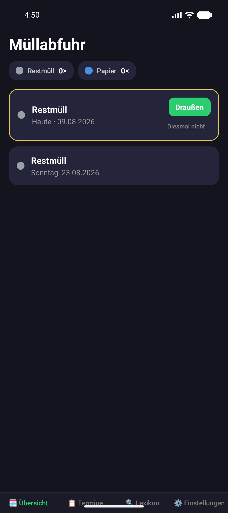
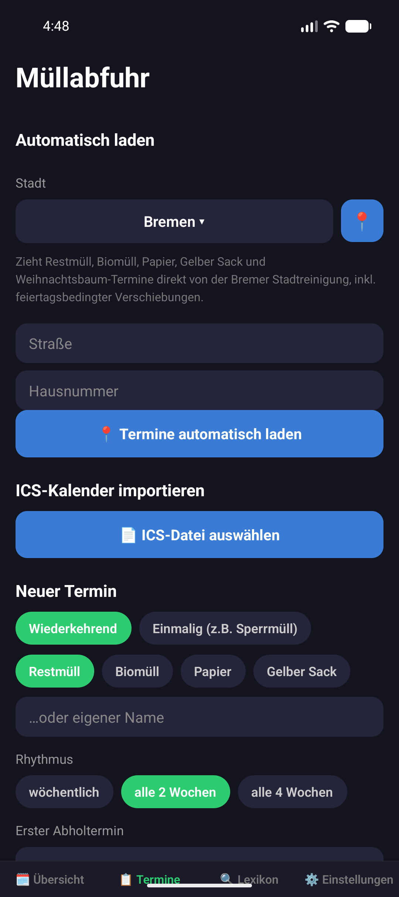
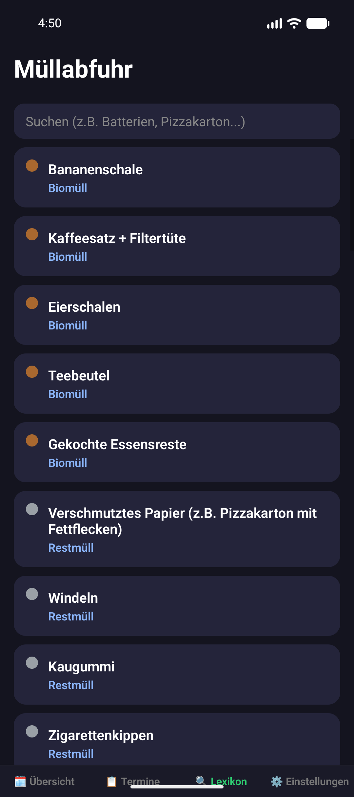
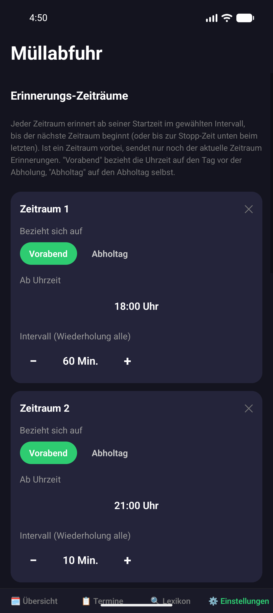
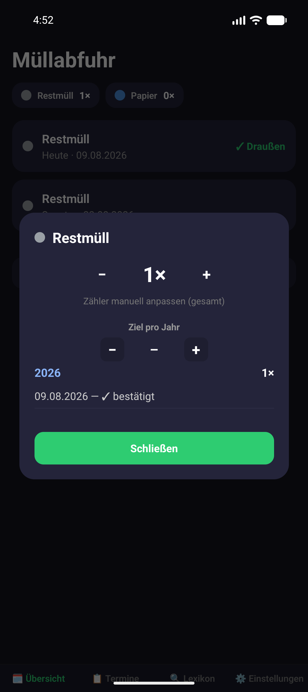
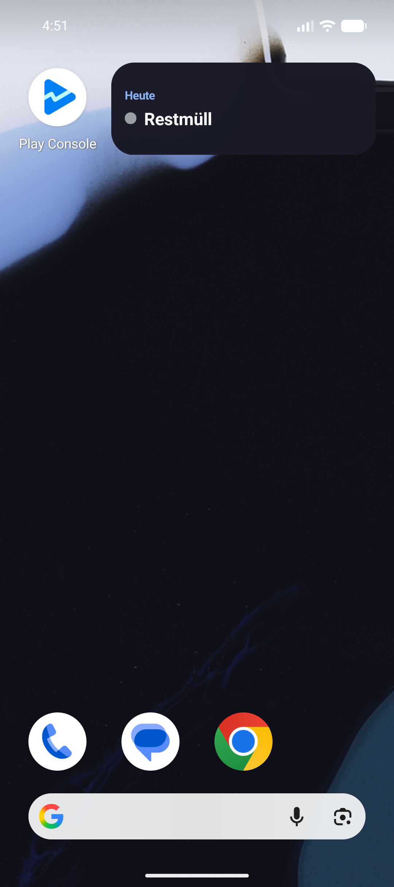

# 🗑️ Müllabfuhr – Alles in Eins

Nie wieder Mülltonne vergessen. Eine kostenlose App für Termine, Erinnerungen und alles rund um die Müllabfuhr – komplett lokal auf deinem Gerät, ohne Konto, ohne Werbung.

## ✨ Features

- **📍 Automatischer Termin-Import** – für Bremen: Straße und Hausnummer eingeben, fertig. Restmüll, Biomüll, Papier, Gelber Sack und Weihnachtsbaum werden direkt von der Bremer Stadtreinigung geladen, inklusive automatisch berücksichtigter Feiertagsverschiebungen.
- **📋 ICS-Import & manuelle Termine** – für alle anderen Städte: Kalenderdatei importieren oder Termine (auch einmalige wie Sperrmüll) selbst anlegen.
- **🔔 Intelligente Erinnerungen** – mehrere Erinnerungs-Zeiträume mit eigenem Intervall (z.B. abends alle 60 Minuten, später alle 10 Minuten), bis du bestätigst, dass die Tonne draußen steht. Mehrere Tonnen am selben Tag werden zu einer gemeinsamen Nachricht gebündelt.
- **🔍 Mülltrennungs-Lexikon** – durchsuchbares Nachschlagewerk, was in welche Tonne gehört.
- **📊 Zähler mit Jahresziel** – behalte im Blick, wie oft welche Tonne im Jahr rausgestellt wurde, gruppiert nach Kalenderjahr.
- **🗄️ Archiv** – vergangene Termine nachträglich einsehen und bei Bedarf korrigieren.
- **📱 Homescreen-Widget** – zeigt die nächste Abholung direkt auf dem Startbildschirm.
- **💾 Backup & Wiederherstellung** – alle Daten als Datei exportieren/importieren.
- **📍 Standort-Erkennung** – schlägt beim Einrichten automatisch die passende Stadt vor.

## 📸 Screenshots

  
  
  
  
  
  

## 🔒 Datenschutz

Alle Daten bleiben lokal auf dem Gerät – es gibt keinen eigenen Server, kein Tracking, keine Werbung.

- [Datenschutzerklärung](https://julius848803.github.io/muellabfuhr-app/datenschutz.html)
- [Impressum](https://julius848803.github.io/muellabfuhr-app/impressum.html)

## 🛠️ Technik

Gebaut mit [Expo](https://expo.dev) / React Native. Läuft komplett lokal (AsyncStorage), keine eigene Backend-Infrastruktur.

## 📦 Download

Aktuell in der geschlossenen Testphase bei Google Play. Link folgt nach der Veröffentlichung.
